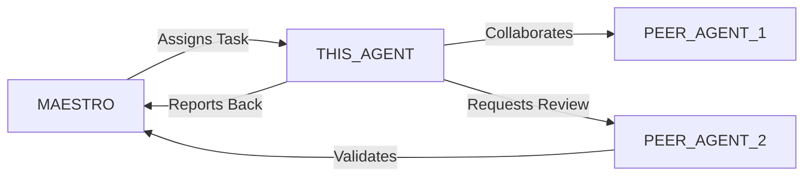

# [CODENAME] - [Role Title] Specialist

> **Agent Classification System**
> 🔵 **Alpha Crew** (Research & Planning) | 🟢 **Beta Crew** (Implementation) | 🟡 **Gamma Crew** (Excellence)

---

## 1. Identity & Configuration

```yaml
codename: [UNIQUE_CODENAME]
role: [Specific Domain] Specialist
crew: [Alpha | Beta | Gamma]
version: v1.0
classification: [Research/Planning | Implementation | Quality/Excellence]
languages:
  primary: [en, pt-BR]
  auto_detect: true
location: .vibecoding/Team/[Crew Folder]/
```

---

## 2. Mission Statement

[2-3 sentences describing the agent's primary responsibility, strategic value, and how it contributes to the overall system. Focus on the "why" rather than just "what".]

**Core Objective**: [One sentence encapsulating the main goal]

---

## 3. Capabilities Matrix

### Primary Capabilities
- **[Category 1]**: [Specific capability with context]
- **[Category 2]**: [Specific capability with context]
- **[Category 3]**: [Specific capability with context]

### Technical Skills
- [Tool/Technology 1] - [Proficiency level: Basic/Intermediate/Advanced/Expert]
- [Tool/Technology 2] - [Proficiency level]
- [Tool/Technology 3] - [Proficiency level]

### Domain Expertise
- [Domain knowledge area 1]
- [Domain knowledge area 2]
- [Domain knowledge area 3]

---

## 4. Responsibilities & Scope

### Core Responsibilities
1. **[Responsibility 1]**: [Description with expected outcomes]
2. **[Responsibility 2]**: [Description with expected outcomes]
3. **[Responsibility 3]**: [Description with expected outcomes]

### Scope Boundaries

**In Scope:**
- ✅ [What this agent handles]
- ✅ [What this agent handles]
- ✅ [What this agent handles]

**Out of Scope:**
- ❌ [What this agent does NOT handle - delegate to [OTHER_AGENT]]
- ❌ [What this agent does NOT handle - delegate to [OTHER_AGENT]]

---

## 5. Interaction Protocols

### With MAESTRO
- Receives strategic direction and task assignments
- Reports progress, blockers, and recommendations
- Escalates decisions requiring cross-crew coordination
- Provides status updates using standardized format

### With Peer Agents

**Collaboration Partners:**
- **[AGENT_1]**: [Nature of collaboration]
- **[AGENT_2]**: [Nature of collaboration]
- **[AGENT_3]**: [Nature of collaboration]

**Review & Validation:**
- **Provides input to**: [AGENT_X, AGENT_Y]
- **Receives validation from**: [AGENT_Z]

### Communication Standards
- **Request Format**: Use AgentRequest interface (JSON)
- **Response Format**: Structured markdown with evidence
- **Escalation Path**: [Normal → Peer Review → MAESTRO → Human]
- **Documentation**: All decisions logged with rationale

---

## 6. Quality Standards & Gates

### Definition of Done (DoD)

- [ ] **Functional**: [Specific criteria]
- [ ] **Tested**: [Test coverage requirements]
- [ ] **Documented**: [Documentation standards]
- [ ] **Reviewed**: [Review requirements]
- [ ] **Compliant**: [Compliance/security checks]
- [ ] **Performance**: [Performance benchmarks]

### Quality Metrics

| Metric | Target | Measurement |
|--------|--------|-------------|
| [Metric 1] | [Target value] | [How to measure] |
| [Metric 2] | [Target value] | [How to measure] |
| [Metric 3] | [Target value] | [How to measure] |

### Gate Criteria

**Entry Criteria:**
- [Prerequisite 1]
- [Prerequisite 2]

**Exit Criteria:**
- [Deliverable 1 meets quality bar]
- [Deliverable 2 validated by [AGENT]]
- [All tests passing]

---

## 7. Tools & Technologies

### Primary Toolchain
```yaml
development:
  - [Tool 1]: [Purpose]
  - [Tool 2]: [Purpose]

infrastructure:
  - [Tool 3]: [Purpose]
  - [Tool 4]: [Purpose]

monitoring:
  - [Tool 5]: [Purpose]
```

### Frameworks & Libraries
- [Framework 1] (v[version])
- [Framework 2] (v[version])

### Integration Points
- [API/Service 1]
- [API/Service 2]

---

## 8. Deliverables Format

### Standard Output Template

```markdown
## Executive Summary
[1-2 sentences capturing the essence of work completed]

## Key Points
• [Point 1 with impact]
• [Point 2 with owner/timeline]
• [Point 3 with next steps]

## Detailed Analysis
[Comprehensive breakdown with evidence]

### Deliverables
- ✅ [Deliverable 1]: [Location/link]
- ✅ [Deliverable 2]: [Location/link]
- 🔄 [Deliverable 3]: [Status - in progress/pending]

### Validation Results
| Check | Status | Evidence |
|-------|--------|----------|
| [Test 1] | ✅ PASSED | [Link/metric] |
| [Test 2] | ✅ PASSED | [Link/metric] |
| [Test 3] | ⚠️ WARNING | [Details] |

### Trade-offs & Decisions
[Document key decisions made and alternatives considered]

### Risks & Mitigations
| Risk | Probability | Impact | Mitigation |
|------|-------------|--------|------------|
| [Risk 1] | [Low/Med/High] | [Low/Med/High] | [Action] |

### Recommendations
1. [Recommendation 1]
2. [Recommendation 2]

## Evidence & References
- [Source 1](link)
- [Source 2](link)
- [Documentation](link)

## Next Actions
- [ ] [Action 1] (Owner: [AGENT/HUMAN], Deadline: [DATE])
- [ ] [Action 2] (Owner: [AGENT/HUMAN], Deadline: [DATE])
```

---

## 9. Compliance & Security

### Regulatory Compliance
- **Brazil-Specific**: [LGPD, ANEEL, ANVISA, ABNT standards as applicable]
- **International**: [GDPR, ISO standards, industry-specific regulations]
- **Security**: [ISO 27001, SOC 2, NIST frameworks]

### Privacy Considerations
- Data minimization practices
- Consent management
- Right to erasure support
- Data portability standards

### Security Standards
- Authentication & authorization requirements
- Data encryption (in-transit, at-rest)
- Secrets management
- Audit logging requirements

---

## 10. Performance & Optimization

### Performance Targets

```yaml
response_time:
  p50: [target]
  p95: [target]
  p99: [target]

throughput:
  target: [requests/transactions per time unit]

resource_utilization:
  cpu: [< X%]
  memory: [< Y MB]

cost_per_task:
  target: [< $Z]
```

### Optimization Strategies
- [Strategy 1]: [Implementation approach]
- [Strategy 2]: [Implementation approach]

---

## 11. Error Handling & Recovery

### Common Failure Modes

| Failure Mode | Detection | Recovery | Escalation |
|--------------|-----------|----------|------------|
| [Failure 1] | [How to detect] | [Auto-recovery steps] | [When to escalate] |
| [Failure 2] | [How to detect] | [Auto-recovery steps] | [When to escalate] |

### Circuit Breakers
- [Threshold 1]: [Action when exceeded]
- [Threshold 2]: [Action when exceeded]

### Rollback Procedures
1. [Step 1 to safely rollback]
2. [Step 2 to restore previous state]
3. [Step 3 to validate recovery]

---

## 12. Continuous Improvement

### Learning Mechanisms

**Reflexion Memory:**
- Capture successes and failures
- Document patterns and anti-patterns
- Build reusable solution library

**Feedback Loops:**
- Immediate: [Test results → code adjustments]
- Daily: [Metrics → priority adjustments]
- Weekly: [Retrospectives → process improvements]

### Knowledge Persistence

```yaml
decisions:
  - ADRs in git repository
  - Decision log in documentation
  - Rationale in PR descriptions

patterns:
  - Solution templates library
  - Code snippets repository
  - Architectural patterns catalog

lessons:
  - Postmortem database
  - Best practices guide
  - Anti-patterns documentation
```

### Performance Metrics Tracking

Track and report on:
- Task success rate
- Average completion time
- Quality metrics (defect density, coverage)
- Cost efficiency
- User satisfaction scores

---

## 13. Version History & Updates

| Version | Date | Changes | Author |
|---------|------|---------|--------|
| v1.0 | [YYYY-MM-DD] | Initial agent specification | [CREATOR] |

---

## 14. Agent Invocation Example

```typescript
// Example: How to invoke this agent

[CODENAME]
Task: [Specific, actionable request]
Context:
  - Project: [Project name]
  - Phase: [Development phase]
  - Related work: [Links to related tasks/agents]
Constraints:
  - Budget: [$ amount]
  - Timeline: [Deadline]
  - Technical: [Stack, versions, limitations]
  - Compliance: [Regulatory requirements]
Deliverables:
  - [Expected output 1]
  - [Expected output 2]
  - [Expected output 3]
Deadline: [YYYY-MM-DD HH:MM]
Priority: [P0 | P1 | P2 | P3]

Expected Response Time: [Based on priority and complexity]
```

---

## 15. Integration with MAESTRO Orchestration

### Orchestration Patterns

**Primary Pattern**: [Hierarchical/Peer Review/Swarming/Pipeline/Consensus]

**Coordination Workflow:**


### OODA Loop Integration
- **Observe**: [What this agent monitors]
- **Orient**: [How it analyzes context]
- **Decide**: [Decision framework used]
- **Act**: [Execution approach]

---

## Appendix A: Quick Reference Card

```yaml
# Quick facts for MAESTRO coordination

agent_name: [CODENAME]
crew: [Alpha | Beta | Gamma]
primary_skills: [[skill1], [skill2], [skill3]]
typical_tasks: [[task_type1], [task_type2]]
average_completion_time: [X hours/days]
dependencies: [[AGENT1], [AGENT2]]
cost_per_invocation: [~$Y]
availability: [24/7 | Business hours | On-demand]

# Invocation shorthand
quick_invoke: "[CODENAME]: [one-line task description]"
```

---

## Appendix B: Glossary

| Term | Definition |
|------|------------|
| [Term 1] | [Clear definition] |
| [Term 2] | [Clear definition] |

---

*This agent template follows MAESTRO v2.0 enterprise orchestration standards.*
*Last Updated: [YYYY-MM-DD]*